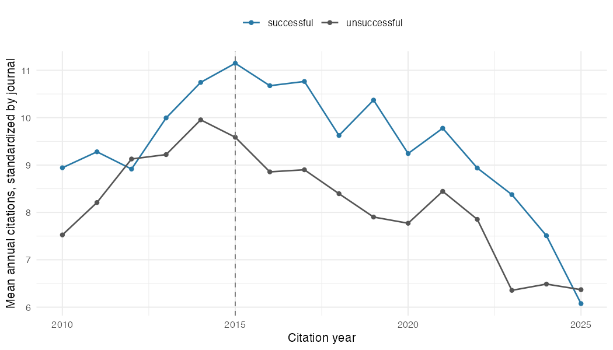

# Psychology replication publicity and subsequent citations

We follow 98 original papers: 59 with unsuccessful replication judgments and 39
with successful judgments. The analysis estimates citation changes after the
project's August 2015 announcement. Earlier individual reports mean this is
additional publicity, not necessarily the first disclosure. Nonreplication is
not classified as a proven original error.

The journal-standardized difference in changes is **$level annual citations**,
comparing 2012–2014 with 2016–2018. The corresponding weighted proportional-growth
contrast is **$proportional**. Brackets contain 95% intervals. These compare
unsuccessful with successful replication outcomes under comparable untreated
citation trajectories within journal. They are not randomized effects.

## Observed citation levels

Means and medians below give each original paper equal weight; the primary
contrast additionally standardizes journal composition. Each period is a paper's
annual average, so the median is not an average of annual medians.

| Replication judgment | Papers | Pre mean | Post mean | Pre median | Post median |
| --- | ---: | ---: | ---: | ---: | ---: |
$levels

## Checks and alternative comparisons

| Specification | Annual citation contrast [95% interval] | Proportional contrast [95% interval] |
| --- | ---: | ---: |
$specifications

Level intervals use a Welch–Satterthwaite calculation across journal/group cells.
Proportional intervals use 9,999 article bootstrap draws within journal and
replication group, with fixed journal weights. The placebo compares 2010–2011
with 2012–2014.

| Replication judgment | External comparison | Annual citation contrast [95% interval] |
| --- | --- | ---: |
$external

External comparisons separately compare each replication group with same-journal,
same-year papers. Nearest-neighbor estimates use three controls and two-way
clustered intervals by target set and original article. Synthetic controls report
point estimates and [pre-period fit](match_fit.csv). Matching uses 2010–2014 only;
reused donors retain their identities. Inference conditions on selected matches.

The [annual event-study estimates](event_study.csv),
[fixed-effects checks](fixed_effects.csv) and
[leave-one-paper-out results](leave_one_out.csv) expose trend and influence
sensitivity. This cohort remains separate from the statistical-error meta-analysis.

## Reproduction and receipts

See the [numbered scripts](../../../../scripts/rpp/README.md),
[analysis plan](design.md) and [verification results](verification.md).
The [identity decisions](identity_decisions.json)
correct source strings and one wrong journal/page locator.
[Timing evidence](disclosure_evidence.csv) records earlier report candidates and
visibility changes; filenames alone do not verify first disclosure. Raw responses
are preserved under `private-data/cohorts/rpp/pipeline/`.

Each stage writes a [receipt](receipts/) with source URLs, retrieval dates, hashes,
executed checks and unresolved cases. Run `make rpp-verify` to check the entire
chain, including upstream source and code changes. Run `make rpp` to rebuild
offline; `make rpp-fetch` acquires missing responses.
