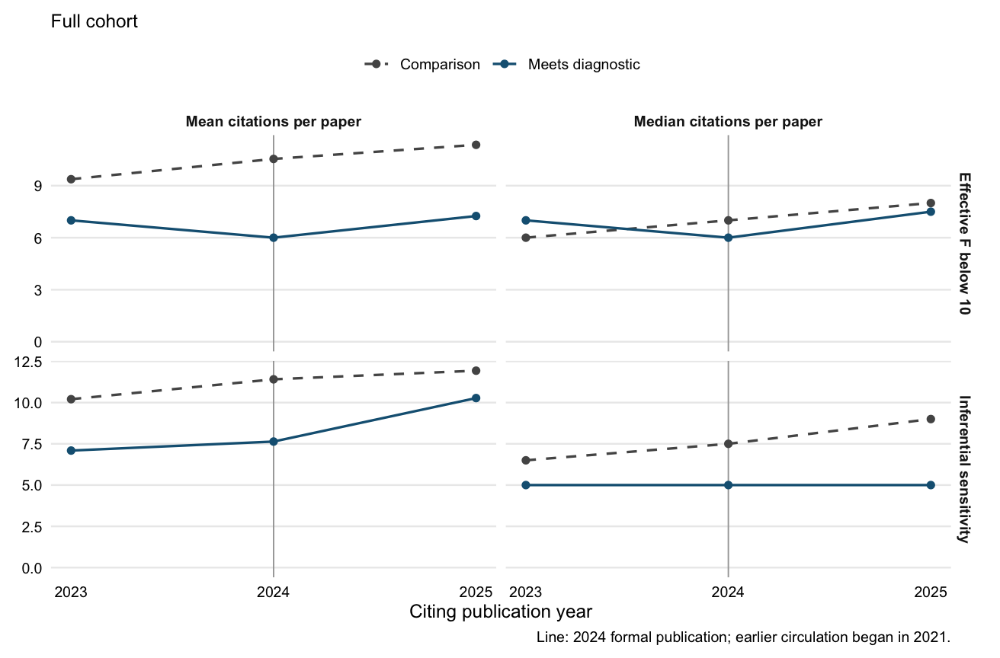

# Citation trajectories after the Lal et al. IV audit

This analysis extends the Nieuwenhuis design to all 67 papers in the IV audit. It compares
annual citations from articles and reviews to papers meeting specified adverse diagnostics
with other assessed papers. Book chapters and preprints enter only the sensitivity analyses.
[Design and timing](design.md) were recorded before estimating the expanded cohort.

## Main comparison: 2023 to 2025

Means and medians describe citations per paper per year. The 2024 transition year is omitted
from the model. The inferential-sensitivity comparison includes only papers with at least one
analytically significant estimate; the weak-F comparison includes all assessed papers.

| Diagnostic | Group | Papers | Mean 2023 | Mean 2025 | Median 2023 | Median 2025 |
| --- | --- | ---: | ---: | ---: | ---: | ---: |
| Effective F below 10 | Comparison | 59 | 9.4 | 11.4 | 6.0 | 8.0 |
| Effective F below 10 | Meets diagnostic | 8 | 7.0 | 7.2 | 7.0 | 7.5 |
| Inferential sensitivity | Comparison | 44 | 10.2 | 11.9 | 6.5 | 9.0 |
| Inferential sensitivity | Meets diagnostic | 11 | 7.1 | 10.3 | 5.0 | 5.0 |
| Either diagnostic | Comparison | 50 | 9.8 | 11.4 | 6.0 | 8.5 |
| Either diagnostic | Meets diagnostic | 17 | 7.1 | 9.3 | 5.0 | 6.0 |
| AR-only sensitivity | Comparison | 52 | 9.8 | 12.1 | 6.0 | 8.5 |
| AR-only sensitivity | Meets diagnostic | 3 | 5.3 | 3.7 | 6.0 | 4.0 |



## Relative and absolute changes

The PPML percentage compares post/pre citation ratios using article and calendar-year fixed
effects. Its intervals use article-clustered covariance and t(G-1) critical values. Absolute
changes compare equal-paper mean changes with HC3 uncertainty.

| Diagnostic | Relative change, % (95% CI) | Absolute difference in changes (95% CI) |
| --- | ---: | ---: |
| Effective F below 10 | -14.5 [-36.0, 14.2] | -1.7 [-4.4, 0.9] |
| Inferential sensitivity | 23.9 [-7.1, 65.3] | 1.5 [-2.8, 5.7] |
| Either diagnostic | 11.8 [-14.6, 46.3] | 0.5 [-2.6, 3.7] |
| AR-only sensitivity | -44.0 [-62.6, -16.0] | -3.9 [-5.9, -1.9] |

## Baseline sensitivity

All entries are relative changes (%). The same-cohort column holds fixed the papers eligible
for a 2022 baseline. Baseline choice changes the sign of the broader sensitivity contrast.

| Diagnostic | 2023 baseline | 2022 baseline | 2023, same cohort as 2022 |
| --- | ---: | ---: | ---: |
| Effective F below 10 | -14.5 | -0.4 | -11.5 |
| Inferential sensitivity | 23.9 | -17.0 | 15.7 |
| Either diagnostic | 11.8 | -12.2 | 7.4 |
| AR-only sensitivity | -44.0 | -30.7 | -42.1 |

## Interpretation and checks

The [interpretation](interpretation.md) discusses what the observed paths imply.
These are citation associations around formal publication, not identified effects of first
learning about an error: the critique circulated from 2021, and the diagnostics do not prove
that substantive findings are false. The broader audit also questions practices shared by
papers in both groups. Only one complete calendar year follows 2024 publication.

The three AR-loss papers' total journal citations change from 16 to 11.
Their model intervals are exploratory and especially fragile with so few flagged papers.
[Their individual paths](ar_individual_paths.png) and
[leave-one-out estimates](../../data/lal/leave_one_out.csv) expose that dependence.

[Longer paths for a fixed older cohort](longer_paths.png) show pre-publication evolution.
[All specifications](../../data/lal/estimates.csv) include alternative baselines, pre-period
and early-circulation comparisons, journal/cohort adjustments, document types, and exclusions
for audit or correction concerns. The design log records changes and their reasons.

## Reproduce

```sh
make lal
make lal-test
```

The frozen frame runs offline using the repository's R environment and Python standard library.
`make lal-fetch` retrieves citation histories; changed live results cannot
overwrite the frozen frame. The data dictionary is in [data.md](data.md).

Source: [Lal et al.](https://doi.org/10.1017/pan.2024.2),
[replication archive](https://doi.org/10.7910/DVN/MM5THZ).
