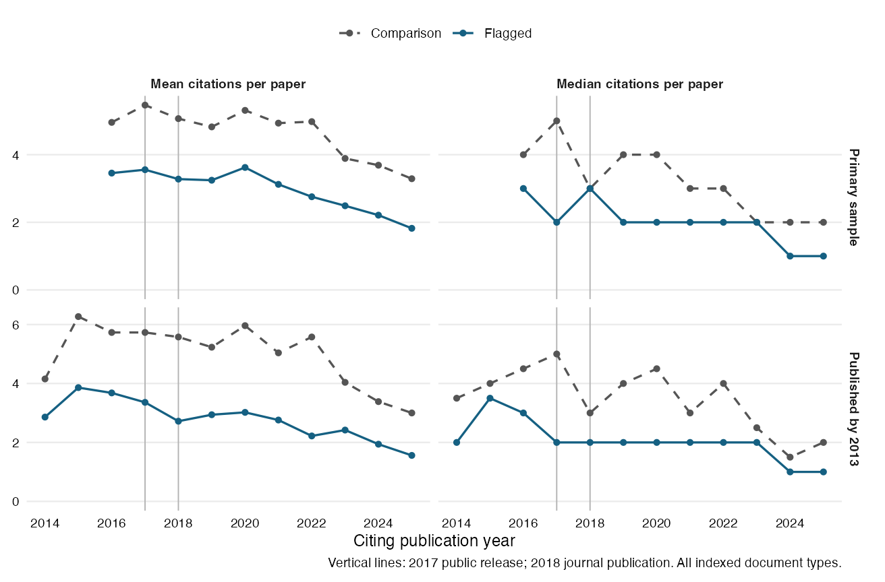

# Citation changes after the pseudoreplication audit

Citation histories are complete for 200 of 200 audited papers. The primary comparison includes 90 flagged and 45 correctly analyzed papers. The 64 unclear assessments remain outside the comparison; one flagged paper had already received a public warning about the same statistical problem in 2013.

The first public preprint appeared September 2, 2017, the identified dataset on September 6, and the journal article on April 4, 2018. The primary contrast compares 2016 with 2019.

| Group | Papers | Mean 2016 | Mean 2019 | Median 2016 | Median 2019 |
| --- | ---: | ---: | ---: | ---: | ---: |
| Flagged | 90 | 3.46 | 3.24 | 3 | 2 |
| Comparison | 45 | 4.96 | 4.82 | 4 | 4 |

Flagged papers' mean citation change minus comparison papers' mean change is -0.08 citations per paper (95% Welch interval [-1.22, 1.07]). The proportional contrast is -3.5% ([-25.4, 24.7]%), estimated by Poisson pseudo-maximum likelihood with article and year fixed effects and article-clustered uncertainty.

The absolute contrast compares changes in citation counts. The proportional contrast compares the groups’ post/pre ratios. Both require comparable counterfactual citation trajectories for a causal interpretation. These are source-assessed methodological problems; corrected numerical results are not supplied. Citations do not establish endorsement or reliance on the affected finding.

## Sensitivity checks

| Specification | Flagged / comparison | Absolute difference [95% interval] | Proportional difference, % [95% interval] |
| --- | ---: | ---: | ---: |
| primary | 90 / 45 | -0.08 [-1.22, 1.07] | -3.5 [-25.4, 24.7] |
| all_classified | 91 / 45 | -0.19 [-1.35, 0.98] | -5.7 [-26.6, 21.2] |
| exclude_all_prior_errata | 89 / 44 | 0.03 [-1.13, 1.18] | -1.4 [-23.7, 27.4] |
| older_cohort | 50 / 26 | -0.24 [-1.60, 1.12] | -12.5 [-33.9, 15.9] |
| longer_window | 90 / 45 | -0.19 [-1.30, 0.92] | -4.9 [-25.5, 21.3] |
| pretrend | 50 / 26 | -0.76 [-1.90, 0.39] | -6.7 [-28.6, 21.8] |
| first_followup_year | 90 / 45 | -0.29 [-1.55, 0.97] | -7.2 [-29.4, 21.9] |

The full-cohort sensitivity includes the earlier-warning paper. The erratum sensitivity excludes all papers with linked prior errata, including corrections unrelated to statistical results. The older cohort was published by 2013; its pretrend contrast compares 2014 with 2016. The longer post period averages 2019–2021. The first-follow-up-year contrast uses 2018, the year after the first public release but the year of journal publication.

See the [split-unit-standardized contrast](../../data/lazic/stratified.csv), [whole-paper bootstrap intervals](../../data/lazic/bootstrap.csv), and [analysis design](design.md). Uncertain citing-publication dates remain unassigned. Counts include all indexed document types, including chapters; collection completeness refers to the API response, not to every citation in the literature.
The primary Poisson fit uses 81 flagged and 44 comparison papers. Ten papers have zero citations in both selected years and contribute no information to its proportional coefficient; they remain in the absolute contrast and descriptive summaries. The exported estimates list every excluded paper.
